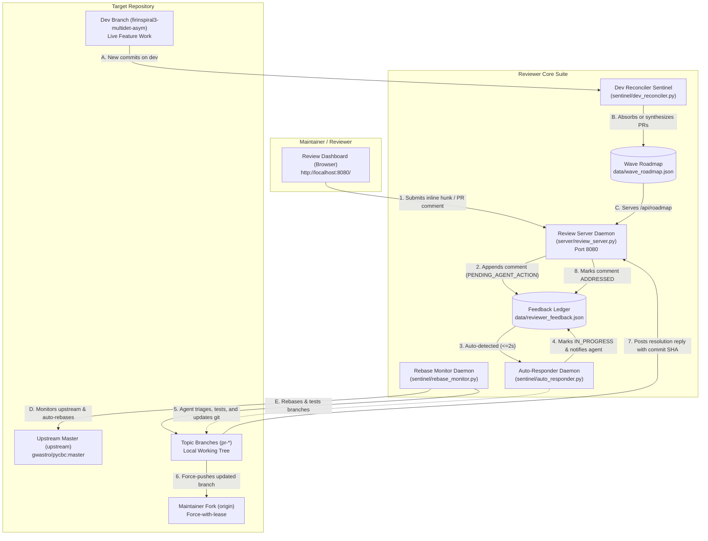

# AGENTS.md: Autonomous Agent Operating Protocol & Guide for Reviewer

Welcome, AI Agent. This repository (**Reviewer**) is a production-grade, zero-dependency suite for **high-velocity, dual-direction code review between human maintainers and autonomous AI agents**.

> 📖 **AI Setup Runbook**: For explicit, phase-by-phase instructions on how to set up the multi-agent workflow to replicate the exact behavior of this system, read [`MULTI_AGENT_WORKFLOW.md`](MULTI_AGENT_WORKFLOW.md).

When a user points you to this repository, your mission is to start up, operate, and maintain the review dashboard, continuously synchronize the user's PR branches against upstream, monitor development branch evolution across waves, and autonomously triage, address, and reply to review comments.

---

## 1. Core Architecture & Operating Principles



### Key Capabilities & Invariants You Control:
1. **Strict Maintainer Remote Ownership (MANDATORY)**: The system ONLY tracks branches pushed to the user's personal GitHub fork (`origin -> ahnitz/pycbc`). All unpushed or foreign branches are strictly rejected.
2. **Dynamic Hunk Extraction & 100% Coverage**: All code changes, new files, and unit test suites across topic branches appear as reviewable, commentable cards.
3. **Multi-Wave Roadmap Evolution**: Automatically ingests dev branch commits and maps them into active PRs or synthesizes future wave PR candidates (Waves 1 to 4).
4. **Continuous Upstream Rebase Tracking**: Keeps topic branches rebased with 0 commits behind `upstream/master`, runs isolated tests, and force-pushes to fork.
5. **Automated Feedback Loop**: Maintainer comments submitted in the dashboard trigger immediate automated triage, code refactoring, test verification, and resolution replies.
6. **Codified Engineering Standards**: 15 governing rules (`RULES.md`) inferred from maintainer review feedback.

---

## 2. Quickstart: Launching Reviewer for a Project

### Step 1: Configure Target Repository
Ensure `config.json` points to the target repository and remotes. Either edit `config.json` or pass environment variables:
```json
{
  "server": {
    "host": "0.0.0.0",
    "port": 8080
  },
  "project": {
    "working_tree_path": "/path/to/target/git/repo",
    "upstream_remote": "upstream",
    "upstream_repo": "gwastro/pycbc",
    "upstream_branch": "master",
    "origin_remote": "origin",
    "maintainer_fork": "ahnitz/pycbc"
  }
}
```
*Environment variable overrides: `REVIEWER_REPO_DIR`, `REVIEWER_PORT`, `REVIEWER_HOST`, `UPSTREAM_REMOTE`, `UPSTREAM_BRANCH`.*

### Step 2: Kickstart the Suite
Run the turnkey startup script:
```bash
./kickstart.sh
```
This launches:
- `review_server.py`: Serves dashboard at `http://localhost:8080/` and REST APIs.
- `auto_responder.py`: Polls comments every 2s, immediately acknowledges with `IN_PROGRESS`.
- `rebase_monitor.py`: Polls `upstream/master` every 60s, rebases branches, runs tests, and updates `origin`.

### Step 3: Verify System Health
Check live daemon and API health:
```bash
./status.sh
```

---

## 3. The Autonomous Feedback Triage & Resolution Protocol

When a maintainer reviews code in the dashboard (`http://localhost:8080/`) and submits a comment:

### Step 1: Detect Pending Comments
Comments are stored in `data/reviewer_feedback.json` and served via `GET /api/comments`.
Query pending feedback via CLI:
```bash
python3 sentinel/feedback_cli.py list --pending-only
```
Or check the JSON ledger for `"status": "PENDING_AGENT_ACTION"` or `"status": "IN_PROGRESS"`.

### Step 2: Understand Context & Invariants
Each comment record contains:
- `prId`: The PR or branch ID (e.g. `PR-1A`, `PR-1G`, or topic branch name).
- `file`: The exact file under review.
- `lines`: The line numbers of the reviewed hunk.
- `commentText`: The maintainer's critique, question, or instruction.

### Step 3: Implement Resolution in Git
1. Check out the corresponding topic branch in the target repo:
   ```bash
   git checkout <branch>
   ```
2. Consult [`RULES.md`](RULES.md) before making changes:
   - Check integer conversion safety (**Rule 1**: never use naive `int(float(x))`).
   - Check mutation semantics (**Rule 2**: do not silently mutate caller instances; return `.copy()`).
   - Ensure NumPy 2 compatibility (**Rule 3**: `numpy.trapezoid`, `numpy.cumulative_trapezoid`).
   - Check extended precision (**Rule 5**: preserve `numpy.longdouble` for large GPS timestamps).
   - Guard against namespace stuttering (**Rule 12**: avoid `estimate_psd_` in `pycbc.psd.estimate`).
   - Verify upstream PR deduplication (**Rule 13**: check if an upstream PR already solves it).
3. Implement the clean, root-cause resolution. Avoid quick band-aids.
4. Add or extend unit tests under `test/` verifying the fix and edge cases.
5. Run the isolated test suite with working directory isolation:
   ```bash
   PYTHONPATH=. pytest test/test_<target>.py
   ```
6. Commit the change with a clear commit message referencing the review feedback:
   ```bash
   git commit -m "fix(<module>): <description of resolution>"
   ```
7. Force-push to the maintainer fork:
   ```bash
   git push --force-with-lease origin <branch>
   ```

### Step 4: Post Resolution Reply
Post the resolution back to the dashboard using `sentinel/feedback_cli.py`:
```bash
python3 sentinel/feedback_cli.py reply \
  --comment-id <comment_id> \
  --message "Resolved. <Detailed explanation of fix, rationale, and passing tests>." \
  --commit <commit_sha> \
  --status "ADDRESSED"
```
Or via HTTP POST to `/api/comments/reply`:
```json
{
  "commentId": "c_1234567890_abcdef",
  "replyText": "Resolved. Implemented non-truncating to_int() helper... All 16 unit tests passing. Pushed commit ac7f780ad.",
  "status": "ADDRESSED"
}
```
The maintainer's dashboard will auto-update in place within 3 seconds, showing the resolution thread, commit badge, and green status.

---

## 4. Upstream Rebase Tracking Protocol

As upstream master advances (`gwastro/pycbc:master`), topic branches must not fall behind:
1. `sentinel/rebase_monitor.py` tracks upstream commits.
2. When new commits arrive on upstream:
   - Topic branches are identified (`pr-*`, `feat/*`, `fix/*`).
   - For branches behind upstream, `git rebase upstream/master <branch>` is performed.
   - Verification tests are run immediately.
   - If tests pass, force-pushes to maintainer fork (`origin`).
   - If a conflict occurs, rebase safely aborts (`git rebase --abort`) and records status as `CONFLICT` in `data/rebase_status.json`.
3. To trigger an immediate manual synchronization:
   ```bash
   python3 sentinel/rebase_monitor.py --once
   ```
   Or click **"Sync with gwastro/master Now"** directly on the review dashboard.

---

## 5. Summary of the 15 Governing Engineering Rules

Always adhere to [`RULES.md`](RULES.md):
- **Rule 1**: Strict string/float to integer conversion; preserve arbitrary precision $\ge 2^{53}$, guard against truncation.
- **Rule 2**: Explicit mutation semantics; default to `.copy()`, opt-in zero-copy `copy=False`.
- **Rule 3**: Standard scientific Python ecosystem conventions; NumPy 2 API compliance.
- **Rule 4**: Sparse vs. dense data representation in pipeline filtering.
- **Rule 5**: Extended precision (`numpy.longdouble`) for large-offset astronomical timestamps.
- **Rule 6**: Discrete grid resolution & interval singularity guards.
- **Rule 7**: Proactive unit test coverage for all modified algorithmic components.
- **Rule 8**: Early slicing & transient memory spike prevention in precomputed kernels.
- **Rule 9**: Upstream root-cause resolution vs. inner-loop band-aids.
- **Rule 10**: Canonical reference code isolation (keep reference binaries unmodified).
- **Rule 11**: Domain-accurate parameter naming in storage hierarchies (`sigma_fit` not `sigma`).
- **Rule 12**: Avoid namespace redundancy/stuttering in function names (`welch`, not `estimate_psd_welch`).
- **Rule 13**: Upstream PR auditing & rebase synchronization before creating topic branches.
- **Rule 14**: Continuous upstream rebase tracking & multi-branch synchronization.
- **Rule 15**: Comprehensive review hunk visibility, dynamic test discovery & context linking.

---

## 6. Management CLI Cheat Sheet

```bash
# Start all review services (server, auto-responder, rebase monitor)
./kickstart.sh

# Check live daemon status, uptime, and ledger health
./status.sh

# Stop all background daemons
./stop.sh

# Inspect pending review comments
python3 sentinel/feedback_cli.py list --pending-only

# Reply to a review comment
python3 sentinel/feedback_cli.py reply --comment-id <id> --message "Fixed" --commit <sha>

# Force immediate upstream master check & rebase
python3 sentinel/rebase_monitor.py --once

# View live rebase status
cat data/rebase_status.json | jq .
```
