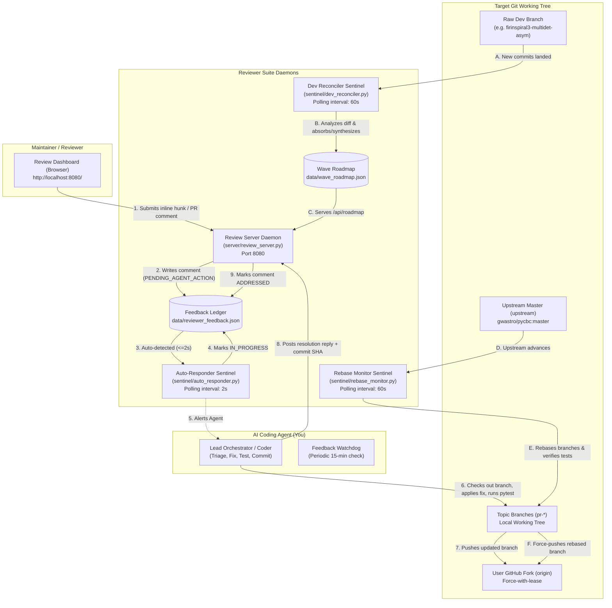

# MULTI_AGENT_WORKFLOW.md: AI Operational Runbook for Replicating the Review System

This document is the **authoritative, step-by-step implementation guide for an AI agent** to set up, operate, and maintain this dual-direction code review and multi-wave PR management system for any project or repository.

---

## 1. System Mission & Core Operating Invariants

When a user points you (the AI agent) to this repository and asks you to set up a code review dashboard and multi-agent workflow for their development work, your goal is to:
1. **Decompose large monolithic development branches** into clean, atomic, review-ready topic branches arranged in dependency waves (Wave 1 through Wave 4).
2. **Launch and manage the interactive review dashboard** (`http://localhost:8080/`) where human maintainers can inspect live diff hunks across all branches, add comments, and track the roadmap.
3. **Run autonomous sentinel background loops** that continuously:
   - Monitor maintainer feedback, autonomously write code fixes/tests, commit, push to fork, and reply to review threads.
   - Monitor `upstream/master`, automatically rebase topic branches, run unit tests, and keep branches 0 commits behind upstream.
   - Monitor the developer's raw feature branch, dynamically absorbing new commits into existing PRs or synthesizing new wave candidates.
4. **Strict Maintainer Ownership Invariant (CRITICAL)**:
   > **The review system must ONLY track branches that are pushed to the user's OWN GitHub fork (`origin -> <username>/<repo>`).**
   > Any request to track an unpushed local branch, an upstream branch, or a third-party branch MUST be strictly rejected. The system is designed to review the user's own work and staged PRs, not external branches.
5. **Mandatory Architectural Rationale Invariant (CRITICAL)**:
   > **Every diff hunk displayed in the review system must provide a concrete Problem statement, Logic & Rationale, and Alternatives Considered & Rejected.**
   > Robotic placeholder strings (`"Implementation update around..."`, `"Refactored code"`) are strictly prohibited. Whenever an AI agent creates, modifies, or refactors a branch, it must register all hunks in `server/rationale_catalog.py`.
6. **Strict Triple-Dot Upstream Diff & Stable Comment Anchoring Invariant**:
   > **Diffs must strictly use `git diff upstream/master...<branch>` to show only true differences against current upstream master.**
   > Historical stale merge bases (`f6eaed241`) must never be used. Inline review comments must remain pinned to their exact file and line context even after branches rebase, never drifting across files.

---

## 2. Multi-Agent Architecture & Topology

The system comprises 5 collaborative agents and background daemons cooperating via shared git state, REST APIs, and a JSON feedback ledger:



### Detailed Agent Roles:
1. **Lead Orchestrator (Primary AI Agent)**:
   - Decomposes the monolithic diff into ordered topic branches.
   - Implements code modifications in response to maintainer comments adhering to [`RULES.md`](RULES.md).
   - Writes unit tests, executes test suites, commits cleanly, and pushes to `origin`.
2. **Review Server (`server/review_server.py`)**:
   - Zero external web dependencies (uses Python's standard `http.server`).
   - Serves `pr_review_dashboard.html` and REST API endpoints (`/api/comments`, `/api/prs`, `/api/roadmap`, `/api/dev/status`, `/api/branches`, `/api/prs/track`).
   - Strictly enforces the maintainer remote check: verifies `origin/<branch>` before allowing any branch to be tracked.
3. **Auto-Responder Sentinel (`sentinel/auto_responder.py`)**:
   - Polls `/api/comments` every 2 seconds.
   - Immediately marks new comments as `IN_PROGRESS` and logs notification for the AI agent.
4. **Rebase Monitor Sentinel (`sentinel/rebase_monitor.py`)**:
   - Polls `upstream/master` every 60 seconds.
   - Checks if topic branches are behind upstream. Automatically rebases, runs pytest verification, and pushes to fork.
5. **Dev Branch Reconciler Sentinel (`sentinel/dev_reconciler.py`)**:
   - Watches the raw feature branch (`firinspiral3-multidet-asym`).
   - As new commits are added, maps changed files to existing wave PRs or synthesizes new wave PR candidates (e.g. `PR-2F`).
   - Persists state in `data/wave_roadmap.json`.
6. **Feedback Watchdog (Cron / Timer)**:
   - Periodic watchdog (every 15 minutes) checking `data/reviewer_feedback.json` for any comments stuck in `PENDING_AGENT_ACTION` or `IN_PROGRESS`.

---

## 3. Step-by-Step Instructions for the AI Agent

Follow these exact steps in order when bootstrapping or maintaining the system:

### Phase 1: Environment Discovery & Git Remote Verification
1. Inspect the target repository directory:
   ```bash
   cd /path/to/target/git/repo
   git remote -v
   ```
2. Identify the remotes:
   - `upstream`: The official upstream repository (e.g., `git@github.com:gwastro/pycbc.git` or `https://github.com/gwastro/pycbc.git`).
   - `origin`: The user's personal GitHub fork (e.g., `git@github.com:ahnitz/pycbc.git`).
3. Identify the user's development branch (e.g., `firinspiral3-multidet-asym`).
4. Find the common ancestor / merge base:
   ```bash
   git merge-base upstream/master firinspiral3-multidet-asym
   # Example: f6eaed241fd115a0b79b459bca83787b19135875
   ```

### Phase 2: Configuration (`config.json`)
Create or update `config.json` in the reviewer suite root:
```json
{
  "server": {
    "host": "0.0.0.0",
    "port": 8080
  },
  "project": {
    "working_tree_path": "/home/ahnitz/projects/claude/searchdev/pycbc-work/apogee",
    "upstream_remote": "upstream",
    "upstream_repo": "gwastro/pycbc",
    "upstream_branch": "master",
    "origin_remote": "origin",
    "maintainer_fork": "ahnitz/pycbc",
    "dev_branch": "firinspiral3-multidet-asym",
    "roadmap_file": "data/wave_roadmap.json",
    "user_requested_branches": [],
    "branch_map": {
      "PR-1A": "pr-fix-core-numpy2-optparse",
      "PR-1B": "pr-fix-io-dictarray-indexing",
      "PR-1C": "pr-fix-events-numpy2-zerolag",
      "PR-1D": "pr-perf-waveform-compress",
      "PR-1E": "pr-feat-vetoes-chisq-slicing",
      "PR-1F": "pr-feat-events-eventmgr-multi",
      "PR-1G": "pr-feat-filter-dynamic-snr-renorm",
      "PR-1H": "pr-feat-inject-injfilter-optimal-snr",
      "PR-1I": "pr-feat-psd-robust-estimators",
      "PR-1J": "pr-feat-strain-regularized-inpainting"
    }
  }
}
```

### Phase 3: PR Decomposition & Topic Branch Creation
1. Audit the full diff between the merge base and the dev branch:
   ```bash
   git diff --stat f6eaed241..firinspiral3-multidet-asym
   ```
2. Partition the changes into independent subsystems:
   - **Wave 1 (Foundational & Independent)**: Pure bug fixes, NumPy 2 compatibility, standalone utilities, and independent optimizations that have zero dependencies on other PRs.
   - **Wave 2 (Preconditioning & Models)**: Strain conditioning, analytical PSD models, and input format readers unblocked by Wave 1.
   - **Wave 3 (Bank & Inner Engine)**: Hierarchical filter banks, ratio matched-filter inner loops, and workflow DAG orchestration unblocked by Waves 1 & 2.
   - **Wave 4 (Search Executable & Dashboards)**: Hierarchical search binaries (`pycbc_inspiral_fir`) and minifollowup diagnostics unblocked by Waves 1–3.
3. For each Wave 1 candidate:
   - Create a clean branch directly off the merge base:
     ```bash
     git checkout -b pr-fix-<subsystem> f6eaed241
     ```
   - Cherry-pick or apply only the targeted files and lines.
   - Ensure corresponding unit tests are present under `test/`.
   - Run the isolated test suite:
     ```bash
     pytest test/test_<target>.py
     ```
   - Push to the user's fork:
     ```bash
     git push -u origin pr-fix-<subsystem>
     ```
4. Register Curated Hunk Rationales in `server/rationale_catalog.py`:
   - For every branch and modified file, add granular entries in `CURATED_HUNKS`:
     ```python
     ("PR-1A", "pycbc/types/config.py"): [
         {
             "symbol": "isidentifier",
             "shortSummary": "Filter invalid shell environment keys during interpolation",
             "rationale": "ConfigParser interpolation crashes if section names or keys contain % or $...",
             "alternatives": "Disabling environment interpolation entirely was rejected..."
         },
         {
             "symbol": "def getint",
             "shortSummary": "Safe arbitrary-precision getint() supporting scientific notation and float strings",
             "rationale": "Delegates integer config parsing to to_int(), preserving arbitrary-precision integers...",
             "alternatives": "Standard configparser.getint() fails on scientific notation and float strings..."
         }
     ]
     ```
   - Ensure every hunk has a distinct symbol pattern so that each hunk displays its own tailored explanation.
5. Run the dev reconciler to initialize `data/wave_roadmap.json`:
   ```bash
   python3 sentinel/dev_reconciler.py --reconcile
   ```

### Phase 4: Launching Background Daemons & Services
Run the turnkey script:
```bash
./kickstart.sh
```
This starts 4 daemons in the background with persistent PID files and logs:
- `server/review_server.py` (Port 8080)
- `sentinel/auto_responder.py` (interval: 2s)
- `sentinel/rebase_monitor.py` (interval: 60s)
- `sentinel/dev_reconciler.py` (interval: 60s)

Verify live status:
```bash
./status.sh
```

### Phase 5: Operating the Feedback Triage & Resolution Loop
When a maintainer writes a review comment on the dashboard:
1. `auto_responder.py` immediately acknowledges the comment (`IN_PROGRESS`).
2. The AI agent inspects pending feedback:
   ```bash
   python3 sentinel/feedback_cli.py list --pending-only
   ```
3. The AI agent analyzes the feedback against [`RULES.md`](RULES.md):
   - **Rule 1**: Integer parsing safety (`to_int()` non-truncating conversion).
   - **Rule 2**: Immutability / copy safety (never silently mutate input references; default to `.copy()`).
   - **Rule 3**: Scientific Python / NumPy 2 conventions (`numpy.trapezoid`, etc.).
   - **Rule 5**: Extended precision preservation (`numpy.float64` / `numpy.longdouble` consistency).
   - **Rule 12**: Avoiding namespace stuttering (e.g. `pycbc.psd.estimate.welch`).
   - **Rule 13**: Upstream PR auditing & deduplication.
   - **Rule 16**: Mandatory architectural rationale (Problem, Logic/Rationale, Alternatives; zero generic placeholders).
   - **Rule 17**: Strict triple-dot diff semantics (`upstream/master...branch`) and stable comment-to-hunk anchoring.
4. The AI agent checks out the topic branch in the target repo:
   ```bash
   git checkout <branch>
   ```
5. Apply the surgical fix and add regression unit tests under `test/`.
6. Run the tests:
   ```bash
   pytest test/test_<target>.py
   ```
7. Register the modified or refactored hunk in `server/rationale_catalog.py`:
   - Add/update the hunk rule with exact `symbol`, `shortSummary`, `rationale`, and `alternatives`.
   - Verify via `curl -s http://localhost:8080/api/pr/<id>/hunks` that all hunks display full architectural descriptions with zero generic placeholders.
8. Commit and force-push to `origin`:
   ```bash
   git commit -m "fix(<subsystem>): <detailed explanation of fix>"
   git push --force-with-lease origin <branch>
   ```
9. Post the verified resolution reply back to the dashboard:
   ```bash
   python3 sentinel/feedback_cli.py reply \
     --comment-id <comment_id> \
     --message "Resolved. <Detailed explanation of fix, rationale, and passing tests>." \
     --commit <new_commit_sha> \
     --status "ADDRESSED"
   ```
   *Within 3 seconds, the maintainer's dashboard automatically reflects the resolution thread, green status badge, and commit link.*

### Phase 6: Operating the Dev Branch Evolution Loop
As the human developer continues coding on `dev_branch`:
1. `sentinel/dev_reconciler.py` polls `dev_branch` every 60 seconds (or runs via `POST /api/dev/reconcile`).
2. It detects new commits that have landed since the last ingested SHA.
3. For each commit:
   - If files match an active Wave 1 PR, it flags it for cherry-picking or update.
   - If files match a queued Wave 2, 3, or 4 PR, it absorbs the changes into that wave's candidate definition.
   - If files are brand new (e.g. `pycbc/frame/gwosc_hdf.py`), it automatically synthesizes a new PR candidate (e.g. `PR-2F`).
4. It updates `data/wave_roadmap.json`.
5. The review dashboard front page displays the updated roadmap, total candidate count, and live commit absorption feed in real time.

### Phase 7: Operating the Upstream Rebase & Merge Cascade
1. When upstream `gwastro/pycbc:master` advances:
   - `sentinel/rebase_monitor.py` automatically detects upstream HEAD movement.
   - It iterates through active topic branches.
   - Executes `git rebase upstream/master <branch>`.
   - Runs `pytest` on the rebased branch.
   - If green, force-pushes with lease to `origin`.
   - If a conflict occurs, aborts safely (`git rebase --abort`), marks `CONFLICT`, and alerts the AI agent.
2. When a Wave 1 PR merges upstream:
   - The coordinator agent pulls `upstream/master`.
   - Dependent Wave 2 branches (PR-2A to PR-2F) are immediately created off the new master base and tested.

---

## 4. Verification Checklist & Self-Test Runbook

After setting up the workflow, run these commands to verify that the entire multi-agent system is working properly:

```bash
# 1. Check all daemon processes and HTTP endpoints
./status.sh

# 2. Verify Review Server REST APIs
curl -s http://localhost:8080/api/health | jq .
curl -s http://localhost:8080/api/dev/status | jq .
curl -s http://localhost:8080/api/roadmap | jq .
curl -s http://localhost:8080/api/branches | jq .

# 3. Test Strict Maintainer Remote Gate (Must REJECT unpushed/invalid branch)
curl -s -X POST http://localhost:8080/api/prs/track \
  -H "Content-Type: application/json" \
  -d '{"branch": "invalid-nonexistent-branch"}' | jq .
# Expected: HTTP 404 or 400 error stating branch is not pushed to origin

# 4. Test Manual Upstream Rebase Sync
python3 sentinel/rebase_monitor.py --once

# 5. Test Dev Branch Reconciliation
python3 sentinel/dev_reconciler.py --reconcile

# 6. Verify Dashboard HTML Rendering
curl -s http://localhost:8080/ | grep -q "Wave 1 Pull Request" && echo "✓ Dashboard Serving OK"
```

---

## 5. Summary of Management CLI Commands

| Command | Purpose |
| :--- | :--- |
| `./kickstart.sh` | Starts all 4 daemons (server, auto-responder, rebase monitor, dev reconciler). |
| `./status.sh` | Checks daemon PIDs, uptime, HTTP health, feedback ledger counts, and roadmap status. |
| `./stop.sh` | Gracefully terminates all background services. |
| `python3 sentinel/feedback_cli.py list --pending-only` | Lists maintainer review comments awaiting action. |
| `python3 sentinel/feedback_cli.py reply --comment-id <id> ...` | Posts resolution reply with commit SHA, marking comment ADDRESSED. |
| `python3 sentinel/dev_reconciler.py --status` | Inspects live dev branch ingestion status and wave candidates. |
| `python3 sentinel/dev_reconciler.py --reconcile` | Runs immediate ingestion scan on dev branch commits. |
| `python3 sentinel/rebase_monitor.py --once` | Forces immediate check and rebase against `upstream/master`. |
