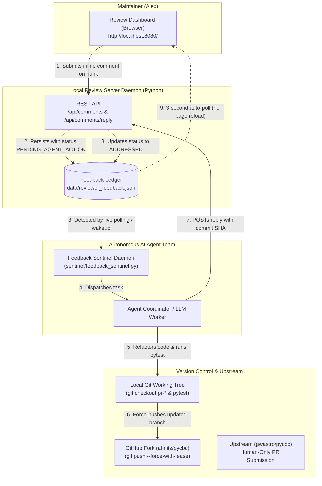

# Dual-Direction Agent Code Review & Coordination System

A production-grade, zero-dependency framework for **high-velocity, bi-directional code review between human maintainers and autonomous AI agents**.

Developed for large-scale Pull Request decomposition and review (e.g. 12,000+ lines across 21 modular PRs in PyCBC), this system couples a clean, GitHub/Stripe-styled reactive web review dashboard with an automated AI agent sentinel, live REST APIs, and git version control.

---

## Architecture Overview



---

## Key Capabilities

1. **Inline Hunk-by-Hunk & PR-Level Review:**
   - Every code diff hunk is presented with the problem statement, architectural thinking, and alternatives considered.
   - Maintainers can comment directly on specific code lines or submit broad PR-wide guidance.
2. **Zero-Reload Live Auto-Sync:**
   - Client-side auto-polling (3s) refreshes threads, agent responses, commit references, and status badges in place without losing scroll or form state.
3. **Automated Git Triage & Execution:**
   - When feedback is received, AI agents check out the target topic branch, execute refactoring/simplification, verify invariants via unit tests (`pytest`), push to the remote fork, and post the resolution back into the dashboard.
4. **Human-in-the-Loop Safeguard:**
   - Strict human-only PR opening: autonomous agents prepare, optimize, and test branches, while the maintainer reviews diffs and opens upstream PRs with a single click.
5. **Completely Self-Contained & Zero Dependencies:**
   - Uses only the standard Python 3 runtime (`http.server`, `json`, `urllib`). No Node.js, npm, webpack, or external web frameworks required.

---

## Directory Structure

```
agent-dual-review/
├── README.md                  # Comprehensive architectural guide & reference
├── kickstart.sh               # Turnkey 1-command startup script
├── stop.sh                    # Clean daemon shutdown script
├── status.sh                  # Live healthcheck and diagnostic script
├── config.json                # System configuration (ports, repos, remotes)
├── .gitignore                 # Ignores runtime logs and PIDs
├── server/
│   └── review_server.py       # Production HTTP server & bi-directional REST API
├── dashboard/
│   ├── pr_review_dashboard.html # Reactive white-mode engineering dashboard
│   └── dashboard_generator.py # Tool to generate review dashboards from manifests
├── sentinel/
│   ├── feedback_sentinel.py   # Background feedback poller & alert daemon
│   └── feedback_cli.py        # Developer/Agent CLI tool for comment management
└── data/
    └── reviewer_feedback.json # Persistent JSON feedback ledger
```

---

## 10-Second Kickstart (Quickstart)

To start the complete system from scratch:

```bash
cd /home/ahnitz/projects/claude/searchdev/agent-dual-review
./kickstart.sh
```

The script will:
1. Verify Python 3.
2. Initialize clean data storage (`data/reviewer_feedback.json`).
3. Check if the server is already active, or launch `server/review_server.py` in the background.
4. Verify HTTP API health.
5. Print direct access links:
   - **Dashboard URL:** `http://localhost:8080/dashboard/pr_review_dashboard.html`
   - **Root URL:** `http://localhost:8080/` (auto-redirects to dashboard)

---

## Management & Diagnostics

### Check Health & Status
```bash
./status.sh
```
Output:
```
=== Dual-Direction Review System Status ===
Process:   RUNNING (PID: 12345)
HTTP API:  HEALTHY (Uptime: 142.5s | Comments: 4 total, 1 pending)
Ledger:    /path/to/data/reviewer_feedback.json (4 total, 1 pending)
Dashboard: http://localhost:8080/dashboard/pr_review_dashboard.html
============================================
```

### Stop the Server
```bash
./stop.sh
```

### Run the Background Sentinel Watcher
To run a real-time terminal watcher that alerts on new maintainer comments:
```bash
python3 sentinel/feedback_sentinel.py
```
Or run a one-shot check (useful for crons or agent scheduled loops):
```bash
python3 sentinel/feedback_sentinel.py --check-once
```

---

## CLI Management Tool (`feedback_cli.py`)

Developers or agents can interact with review threads directly from the command line:

### 1. List All or Pending Comments
```bash
# List all comments
python3 sentinel/feedback_cli.py list

# List only comments requiring agent action
python3 sentinel/feedback_cli.py list --pending-only

# Filter by PR ID
python3 sentinel/feedback_cli.py list --pr PR-1B
```

### 2. Post an Agent Reply & Mark Addressed
```bash
python3 sentinel/feedback_cli.py reply <comment_id> \
  --message "Refactored DictArray slice to avoid full memory copy. Added unit test. Passed 5/5." \
  --status ADDRESSED \
  --commit 1426ce5d9
```

### 3. Add a Review Comment from Terminal
```bash
python3 sentinel/feedback_cli.py add \
  --pr PR-1A \
  --message "Please drop the obsolete --legacy-weights option." \
  --hunk 0 \
  --file "pycbc/types/optparse.py"
```

---

## REST API Specification

The review server exposes lightweight JSON endpoints:

### `GET /api/health`
Returns system uptime and feedback metrics.
```json
{
  "status": "healthy",
  "uptimeSeconds": 312.4,
  "totalComments": 2,
  "pendingComments": 0,
  "dataFile": "/path/to/data/reviewer_feedback.json"
}
```

### `GET /api/comments`
Retrieves all comments, hunk context, and agent reply threads.
```json
{
  "status": "ok",
  "comments": [
    {
      "id": "c_1728413200_a1b2c3",
      "prId": "PR-1B",
      "hunkIndex": 0,
      "file": "pycbc/io/hdf.py",
      "lines": "lines 45-60",
      "commentText": "Can we avoid this temporary list creation?",
      "author": "Maintainer (Alex)",
      "status": "ADDRESSED",
      "createdAt": "2026-10-08T18:50:00Z",
      "replies": [
        {
          "id": "r_1728413210_d4e5",
          "author": "Antigravity AI Responder",
          "replyText": "Replaced with an in-place generator. Verified test suite passed.",
          "createdAt": "2026-10-08T18:50:45Z",
          "commitSha": "1426ce5d9"
        }
      ]
    }
  ]
}
```

### `POST /api/comments`
Submit new review feedback from maintainer.
- **Request Body:**
  ```json
  {
    "prId": "PR-1B",
    "hunkIndex": 1,
    "file": "pycbc/io/hdf.py",
    "lines": "lines 110-125",
    "commentText": "Please remove dead branch here.",
    "author": "Maintainer (Alex)"
  }
  ```
- **Response:** `201 Created` with generated comment record.

### `POST /api/comments/reply`
Submit an agent reply and update status.
- **Request Body:**
  ```json
  {
    "commentId": "c_1728413200_a1b2c3",
    "replyText": "Dead branch removed, tested, and pushed to origin.",
    "status": "ADDRESSED",
    "commitSha": "abc12345",
    "author": "Antigravity AI Team"
  }
  ```
- **Response:** `200 OK`

---

## How to Kickstart from Scratch in a Brand New Environment

If moving to a clean machine or fresh server:

1. **Clone the repository:**
   ```bash
   git clone git@github.com:ahnitz/agent-dual-review.git
   cd agent-dual-review
   ```
2. **Make scripts executable:**
   ```bash
   chmod +x kickstart.sh stop.sh status.sh server/review_server.py sentinel/feedback_sentinel.py sentinel/feedback_cli.py
   ```
3. **Adjust `config.json`:**
   Set `working_tree_path`, `maintainer_fork`, and `upstream_repo` to target your project.
4. **Launch:**
   ```bash
   ./kickstart.sh
   ```
5. **Open Dashboard:**
   Point your browser to `http://<server-ip>:8080/dashboard/pr_review_dashboard.html`.
