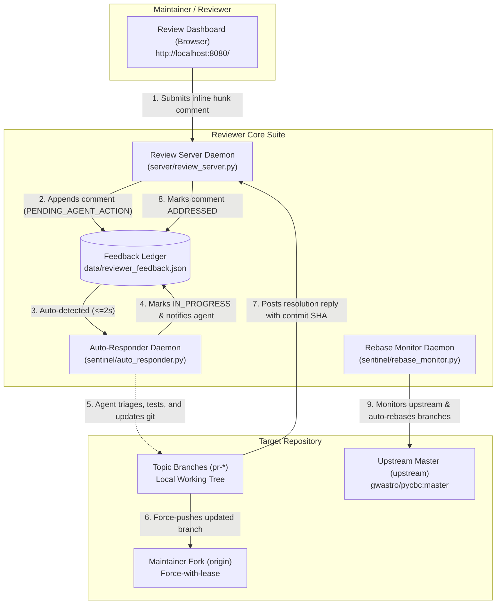

# Reviewer: Dual-Direction PR Review & Upstream Sync Suite

A production-grade, zero-dependency platform for **high-velocity, dual-direction code review, continuous upstream rebase tracking, and automated feedback triage between human maintainers and autonomous AI agents**.

> **Intended Use**: Point your AI agent (or team) to this repository to start up an interactive review dashboard, monitor upstream branches, and autonomously address maintainer feedback across any set of Pull Requests or topic branches.

---

## Architecture Overview



---

## Key Capabilities

1. **100% Code & Test Review Coverage (Zero Omission)**:
   - Dynamic git diff ingestion against the true upstream merge base.
   - Newly created unit test suites, helper modules, and configuration changes automatically appear as distinct, commentable hunk cards.
2. **Quad-Action Code & Context Navigation**:
   - **GitHub Link**: Jumps to the exact lines (`#L10-L40`) on the remote fork.
   - **Local File Link**: Directly inspects the local file in the browser (`file://...`).
   - **Open in IDE**: Deep-links directly to the file and cursor line in editor (`vscode://...`).
   - **Copy :line**: 1-click clipboard copy (`path/to/file.py:42`) for instant terminal jump.
3. **Continuous Upstream Rebase Tracking**:
   - Background daemon (`sentinel/rebase_monitor.py`) polls upstream (e.g. `gwastro/pycbc:master`).
   - Automatically rebases topic branches when upstream moves, runs isolated verification tests with `PYTHONPATH=.`, and force-pushes clean branches to fork.
   - Safe conflict abort (`git rebase --abort`) preserving working tree integrity.
4. **Automated Feedback Loop & In-Place Updates**:
   - Maintainer comments trigger immediate acknowledgment (`IN_PROGRESS`) and agent triage.
   - Once resolved and tested, replies with commit SHA and rationale are posted back.
   - Dashboard auto-polls every 3s—threads, status badges, and commit links refresh live without full page reload.
5. **Codified Engineering Standards**:
   - 15 governing rules ([`RULES.md`](RULES.md)) inferred from maintainer review comments, establishing standards for numerical precision, mutation semantics, NumPy 2 compatibility, upstream PR deduplication, and testing.
6. **Zero Dependencies & Fully Portable**:
   - Standard Python 3 runtime (`http.server`, `urllib`, `subprocess`, `json`). No npm, Node.js, or heavyweight web frameworks required.

---

## 10-Second Quickstart

To launch the complete suite on your machine:

```bash
# 1. Clone this repository
git clone git@github.com:ahnitz/reviewer.git
cd reviewer

# 2. Kickstart all services (server, auto-responder, rebase monitor)
./kickstart.sh
```

Open your browser to:
**`http://localhost:8080/`**

### Checking Status & Stopping Services

```bash
# Check status of server, daemons, and feedback ledger
./status.sh

# Stop all background services cleanly
./stop.sh
```

---

## Configuring for Any Target Repository

Reviewer is designed to work with ANY repository and set of PR branches. Configuration can be specified in `config.json` or via environment variables / CLI arguments:

### Example `config.json`

```json
{
  "server": {
    "host": "0.0.0.0",
    "port": 8080
  },
  "storage": {
    "feedback_file": "data/reviewer_feedback.json",
    "rebase_status_file": "data/rebase_status.json"
  },
  "project": {
    "working_tree_path": "/home/user/projects/my-repo",
    "upstream_remote": "upstream",
    "upstream_repo": "upstream-org/my-repo",
    "upstream_branch": "master",
    "origin_remote": "origin",
    "maintainer_fork": "my-fork/my-repo",
    "branch_patterns": ["pr-*", "feat/*", "fix/*"],
    "branch_map": {
      "PR-1A": "pr-fix-core-numpy2-optparse",
      "PR-1B": "pr-fix-io-dictarray-indexing"
    }
  },
  "rebase": {
    "interval_seconds": 60,
    "auto_push": true
  }
}
```

### Environment Variable Overrides

| Variable | Description | Default |
| :--- | :--- | :--- |
| `REVIEWER_PORT` | HTTP server port | `8080` |
| `REVIEWER_HOST` | HTTP server host binding | `0.0.0.0` |
| `REVIEWER_REPO_DIR` | Path to local git working tree | Auto-detected / current repo |
| `UPSTREAM_REMOTE` | Git remote name for upstream | `upstream` |
| `UPSTREAM_BRANCH` | Upstream branch to track | `master` |
| `ORIGIN_REMOTE` | Git remote name for maintainer fork | `origin` |

---

## Repository Structure

```
reviewer/
├── AGENTS.md                  # Comprehensive AI agent operating protocol
├── README.md                  # System architecture, capabilities & quickstart
├── RULES.md                   # 15 Codified Engineering Rules & PR Standards
├── config.json                # Active configuration (repos, ports, remotes)
├── config.example.json        # Clean configuration template
├── kickstart.sh               # Turnkey 1-command startup script
├── status.sh                  # Live healthcheck and diagnostic script
├── stop.sh                    # Clean daemon shutdown script
├── server/
│   └── review_server.py       # REST API & dynamic git diff extraction server
├── dashboard/
│   ├── pr_review_dashboard.html # Reactive review dashboard UI
│   └── dashboard_generator.py # Manifest-based dashboard generator
├── sentinel/
│   ├── rebase_monitor.py      # Standing daemon for upstream rebase & verification
│   ├── auto_responder.py      # Automated triage and comment response daemon
│   ├── feedback_sentinel.py   # Polling watchdog and notification generator
│   └── feedback_cli.py        # CLI for inspecting and replying to comments
└── data/
    ├── reviewer_feedback.json # Persistent feedback ledger
    └── rebase_status.json     # Live upstream branch synchronization status
```

---

## Command-Line Interface (CLI)

Reviewer includes a dedicated CLI for developers and agents to interact with feedback without using the browser:

```bash
# List all pending review comments requiring action
python3 sentinel/feedback_cli.py list --pending-only

# List comments on a specific PR
python3 sentinel/feedback_cli.py list --pr PR-1A

# Reply to a comment, update status, and record commit SHA
python3 sentinel/feedback_cli.py reply \
  --comment-id c_1791485790_a52213 \
  --message "Resolved. Implemented safe to_int() helper. All 16 unit tests passing." \
  --commit ac7f780ad \
  --status ADDRESSED

# Run a 1-shot upstream check and branch rebase
python3 sentinel/rebase_monitor.py --once
```

---

## Codified PR Rules & Engineering Standards

All PRs and code modifications produced through Reviewer adhere to the 15 Codified Rules in [`RULES.md`](RULES.md):

- **Rule 1**: Integer Precision & Strict String Coercion
- **Rule 2**: Explicit Mutation Semantics & Copy Isolation
- **Rule 3**: Standard Scientific Python Ecosystem Conventions (NumPy 2)
- **Rule 4**: Sparse vs. Dense Data Representation in Pipeline Filtering
- **Rule 5**: Extended Precision for Large-Offset Astronomical Time Arithmetic
- **Rule 6**: Discrete Grid Resolution & Interval Singularity Guards
- **Rule 7**: Proactive Unit Test Coverage for Core Algorithmic Components
- **Rule 8**: Early Slicing & Transient Memory Spikes in Precomputed Kernels
- **Rule 9**: Upstream Root-Cause Resolution vs. Inner-Loop Bandaids
- **Rule 10**: Canonical Reference Code Isolation
- **Rule 11**: Domain-Accurate Parameter Naming in Storage Hierarchies
- **Rule 12**: Avoid Namespace Redundancy / Stuttering in Function Names
- **Rule 13**: Upstream PR Auditing & Rebase Synchronization
- **Rule 14**: Continuous Upstream Rebase Tracking & Multi-Branch Synchronization
- **Rule 15**: Comprehensive Review Hunk Visibility, Dynamic Test Discovery & Context Linking

---

## Pointing an AI Agent to Reviewer

When delegating PR review and maintenance to an AI Agent:
1. Provide the repository URL: `https://github.com/ahnitz/reviewer`
2. Instruct the agent:
   > *"Read AGENTS.md in the reviewer repository, run `./kickstart.sh` for our repository, and continuously monitor `http://localhost:8080/` to address my review comments and keep our branches rebased against upstream master."*
3. The agent will follow the automated protocol in [`AGENTS.md`](AGENTS.md) and adhere to [`RULES.md`](RULES.md).
