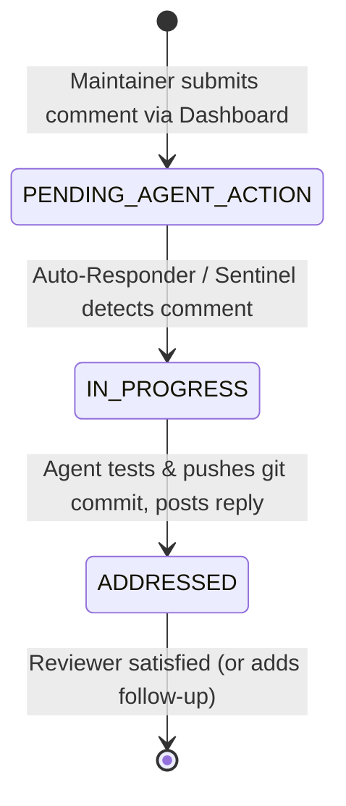

# Review Dashboard Architecture & Operational Guide

The **Dual-Direction Review Dashboard** (`pr_review_dashboard.html`) is an interactive, zero-dependency engineering interface designed to let maintainers **primarily work and review code directly through their browser**, communicating bidirectionally with autonomous AI agents.

---

## 1. Design Principles

* **GitHub / Stripe Documentation Aesthetic:** High-contrast clean white background, subtle slate borders, and crisp typography. Completely free of generic AI visual cliches (no robotic icons, floating chatbots, or glowing neon gradients).
* **Maintainer Velocity First:** Organizes multi-thousand-line branches into atomic, bite-sized Pull Requests with clear cognitive separation between code hunks.
* **Bi-Directional Interactivity:** The maintainer can comment directly inline on diff hunks or write high-level PR guidance. AI agents automatically pick up requests, refactor code, run tests, and post responses into the dashboard live.
* **Zero-Reload State Preservation:** Employs client-side reactive DOM polling (3-second interval) so status changes, test logs, and agent replies appear live without disturbing scroll position or in-progress typing.

---

## 2. Interface Hierarchy & Sections

```
┌────────────────────────────────────────────────────────────────────────┐
│ Header: Project Title, Upstream Targets, Merge Base, Sync Status       │
├────────────────────────────────────────────────────────────────────────┤
│ Top Tab Navigation: [Overview] [PR-1A] [PR-1B] ... [Review Threads (N)]│
├────────────────────────────────────────────────────────────────────────┤
│ PR Page Layout:                                                        │
│  ├─ PR Header & GitHub Toolbar (Open PR →, Diff View, Branch, Copy Cmd)│
│  ├─ Live PR Discussion Threads Box (PR-level feedback & thread index)  │
│  ├─ 1. Architectural Rationale & Problem vs. Solution Strategy         │
│  ├─ 2. Hunk-by-Hunk Code Analysis & Line Rationale                     │
│  │   ├─ Hunk 1: Diff Snippet                                           │
│  │   │   ├─ Thinking Behind This Change & Alternatives Considered      │
│  │   │   ├─ Inline Review Thread (Comments + Agent Replies)            │
│  │   │   └─ [Add Review Comment on Hunk 1] Button                      │
│  │   └─ Hunk 2...                                                      │
│  ├─ 3. "Improve, Don't Just Merge" — Simplifications over Dev Prototype│
│  ├─ 4. Verification Command & Invariant Guarantees (pytest & timing)   │
│  └─ 5. General Browser-Saved Notes                                     │
└────────────────────────────────────────────────────────────────────────┘
```

---

## 3. How the Dashboard Functions Under the Hood

### A. Real-Time Client-Side Auto-Polling
```javascript
// Initial load
loadServerComments();
renderNav();
renderContent();

// 3-second non-intrusive polling loop
setInterval(loadServerComments, 3000);
```
* Queries `GET /api/comments?t=<timestamp>` to prevent browser HTTP caching.
* Performs deep equality comparison (`JSON.stringify(newComments) !== JSON.stringify(serverComments)`).
* If changes are detected, it updates only the active thread containers and navigation badges in-place via DOM manipulation.

### B. Hunk-Anchored Comments vs. PR-Level Comments
* **Hunk-Anchored Comments:** When a user clicks *"Add Review Comment on Hunk N"*, the comment payload sends:
  ```json
  {
    "prId": "PR-1A",
    "hunkIndex": 0,
    "file": "pycbc/types/optparse.py",
    "lines": "lines 99-122",
    "commentText": "...",
    "author": "Maintainer (Alex)"
  }
  ```
  The comment is anchored directly below that code block in Section 2.
* **PR-Level Comments:** When submitted via *"Add PR-Level Feedback"*, `hunkIndex` is `-1`, `file` is `"PR-level discussion"`, and `lines` is `"General"`. It appears in the top discussion card for that PR.
* **Orphaned / Refactored Hunk Preservation:** If a subsequent commit alters or removes a hunk, comments previously attached to that hunk index are automatically preserved and surfaced in the top PR Discussion Box with the badge `(Hunk modified in later commit)` so no feedback is ever lost.

### C. Smooth Scrolling & Visual Highlighting (`scrollToHunk`)
Clicking *"Scroll to Hunk N ↓"* from the PR-level summary executes:
```javascript
function scrollToHunk(prId, hunkIdx) {
  const hunkEl = document.getElementById(`hunk-card-${prId}-${hunkIdx}`);
  if (hunkEl) {
    hunkEl.scrollIntoView({ behavior: 'smooth', block: 'center' });
    hunkEl.classList.add('ring-2', 'ring-blue-500');
    setTimeout(() => hunkEl.classList.remove('ring-2', 'ring-blue-500'), 2500);
  }
}
```
This smoothly glides down the page and pulses a blue highlight ring around the target hunk card.

---

## 4. Comment Lifecycle State Machine

Each comment progresses through three well-defined states:



1. **`PENDING_AGENT_ACTION` (Amber Badge):** Default state upon submission. Triggers automated agent pickup.
2. **`IN_PROGRESS` (Blue Badge):** Auto-responder immediately acknowledges the request and indicates that code analysis and test execution are actively underway.
3. **`ADDRESSED` (Emerald Green Badge):** The AI team has implemented the requested refactoring on the topic branch, verified test suites, force-pushed to the GitHub fork, and supplied the commit SHA and diff link.

---

## 5. Direct GitHub Integration Links

Each PR tab generates direct URLs targeting the maintainer's fork and upstream repository:

* **Open PR on GitHub:**
  `https://github.com/gwastro/pycbc/compare/master...ahnitz:pycbc:<branch>?expand=1`
  *(Pre-populates the PR title and description on GitHub with one click).*
* **Compare Diff View:**
  `https://github.com/gwastro/pycbc/compare/master...ahnitz:pycbc:<branch>`
* **Branch Browser:**
  `https://github.com/ahnitz/pycbc/tree/<branch>`
* **Commit SHA Direct Link:**
  `https://github.com/ahnitz/pycbc/commit/<commitSha>`

---

## 6. How to Customize or Repurpose the Dashboard

The dashboard data is driven by the `PR_PAGES` JavaScript array at the top of `<script>` in `pr_review_dashboard.html`.

Each PR object follows this schema:
```javascript
{
  id: "PR-1A",
  shortName: "Core & NumPy 2",
  branch: "pr-fix-core-numpy2-optparse",
  commitSha: "4de9d9198",
  title: "fix(core): numpy2 compatibility, optparse float-string ints, bounds checks",
  diff: "+21 / -9 (~30 lines, 4 files)",
  diffBadge: "+21 / -9",
  category: "Core & Compatibility",
  wave: 1,
  testCmd: "pytest test/test_optparse.py",
  testTiming: "4 passed in 0.82s",
  unblocks: "Wave 2 (Strain Conditioning)",
  diffCmd: "git diff f6eaed241..pr-fix-core-numpy2-optparse",
  ghCompareUrl: "https://github.com/...",
  ghCreatePrUrl: "https://github.com/.../compare/.../?expand=1",
  ghBranchUrl: "https://github.com/.../tree/...",
  ghCommitUrl: "https://github.com/.../commit/...",
  problemDescription: "...",
  solutionDescription: "...",
  simplificationDeepDive: "...",
  hunks: [
    {
      file: "path/to/file.py",
      lines: "lines 10-25",
      shortSummary: "Summary of edit",
      diffSnippet: "- old code\n+ new code",
      rationale: "Why this was changed",
      alternatives: "Alternatives considered"
    }
  ]
}
```

Use `dashboard/dashboard_generator.py --create-sample-manifest manifest.json` to generate starter templates for other projects.
